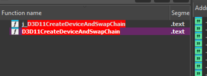
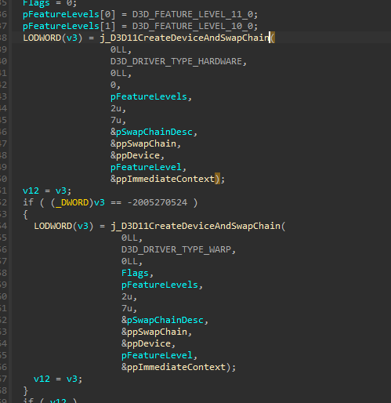
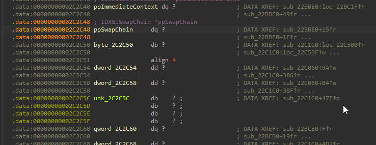
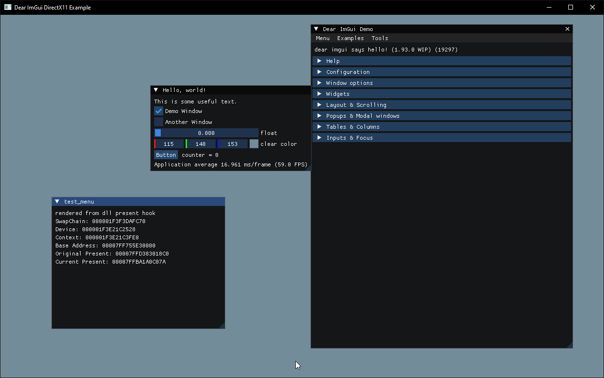

# DX11 Hook Example

## What is this?

A DLL that hooks `IDXGISwapChain::Present` in the DirectX 11 [ImGui](https://github.com/ocornut/imgui) example and renders an overlay into the game's swap chain using ImGui. The goal was to demonstrate reverse engineering and runtime hooking skills on a real target.

## Why I did it

Most DX11 overlays work by finding the swap chain at runtime and detouring its `Present` method. I wanted to build one from scratch starting with IDA, finding the swap chain pointer in the binary, and ending with a working injected DLL that draws a menu over the target.

## Tools

- **IDA** - used for static analysis to locate the swap chain and the offset of its global pointer
- **Visual Studio** - compiled the injected DLL

## Reversing

The reversing was straightforward once I knew what to look for. All DX11 applications create their swap chain through a small set of D3D11 API calls, so I started by searching for those imports.

I searched for anything referencing `SwapChain` and found these two functions:



The call was made through the import thunk `j_D3D11CreateDeviceAndSwapChain`, which jumps into the real `D3D11CreateDeviceAndSwapChain` exported by `d3d11.dll`. Looking at the call site, I could see the `ppSwapChain` output parameter being passed in:



`&ppSwapChain` is a reference to a module-level global, so I clicked through to the symbol in `.data` and noted its address:



After rebasing the image to `0x0` (so addresses displayed in IDA match RVAs directly), the global lived at RVA `0x2C2C48`. At runtime, the address is:

```
swapchain_ptr = module_base + 0x2C2C48
```

That single offset was all I needed.

## The Hook

The DLL polls the swap chain global until the game creates it. Once it's non-null, I patch slot 8 of the swap chain's vtable (`Present`) with my own function. My hook runs the ImGui frame, draws the menu, then calls the original `Present` so the game's rendering is unaffected.



The menu displays the swap chain pointer, the original `Present` address, and the hooked `Present` address to verify the detour took effect.

## How I knew which vtable slot to use

`IDXGISwapChain` is a COM interface, and like all COM interfaces it inherits from `IUnknown`. The vtable is built in inheritance order:

| Offset | Slot | Method |
|---|---|---|
| 0x00 | 0 | `QueryInterface` |
| 0x08 | 1 | `AddRef` |
| 0x10 | 2 | `Release` |
| 0x18 | 3 | `SetPrivateData` |
| 0x20 | 4 | `SetPrivateDataInterface` |
| 0x28 | 5 | `GetPrivateData` |
| 0x30 | 6 | `GetParent` |
| 0x38 | 7 | `GetDevice` |
| **0x40** | **8** | **`Present`** |
| 0x48 | 9 | `GetBuffer` |
| ... | ... | ... |

This layout is fixed by the DirectX SDK headers, so `Present` is always at slot 8 on any Windows machine. I confirmed it in IDA by dumping the `IDXGISwapChainVtbl` struct from the type library.

## How it works

```
Inject DLL
    │
    ▼
read module_base + 0x2C2C48
    │
    ▼
poll until *ppSwapChain != null
    │
    ▼
vtable = *(void***)pSwapChain
    │
    ▼
save old Present pointer
overwrite slot 8 with hk_present
    │
    ▼
game calls Present → hk_present
    │
    ├─ ImGui frame: NewFrame / draw_menu / Render
    │
    └─ call original Present  (game renders normally)
    │
    ▼
frame presented
```

## Building

1. Open `DX11_hook_example.sln` in Visual Studio 2026
2. Set configuration to **Release / x64** (must match the target's bitness)
3. Build — the DLL outputs to `bin/x64/Release/`

## Usage

1. Launch the ImGui DX11 example (`example_win32_directx11.exe`)
2. Inject `DX11_hook_example.dll` with any injector (Xenos, Extreme Injector, or any other)
3. A console window opens and logs the hook status
4. The menu renders on top of the target window

## Known limitations

- `ResizeBuffers` is not yet hooked — resizing the window may leave the overlay stretched or crash the target
- The back-buffer render target view is recreated every frame instead of being cached
- The `WndProc` hook is not restored when the DLL unloads
- Only tested against the ImGui DX11 example; other engines may use `D3D11CreateDevice` + `IDXGIFactory::CreateSwapChain` instead, which would require an additional hook point
